# Executive Function App
> Generated by [`prisma-markdown`](https://github.com/samchon/prisma-markdown)

- [default](#default)

## default

```mermaid
erDiagram
"Account" {
  String id PK
  String userId FK
  String type
  String provider
  String providerAccountId
  String refresh_token "nullable"
  String access_token "nullable"
  Int expires_at "nullable"
  String token_type "nullable"
  String scope "nullable"
  String id_token "nullable"
  String session_state "nullable"
}
"Session" {
  String id PK
  String sessionToken UK
  DateTime expires
  String userId FK
}
"User" {
  String id PK
  String name "nullable"
  String email UK "nullable"
  DateTime emailVerified "nullable"
  String image "nullable"
  String personId FK "nullable"
}
"VerificationToken" {
  String identifier
  String token UK
  DateTime expires
}
"Person" {
  String id PK
  String name
  String pronouns
  String bio "nullable"
  DateTime createdAt
  DateTime updatedAt
  Boolean isActive
  ContactMethod preferredContactMethod "nullable"
  Int volunteerQuestionId
}
"PII" {
  String id PK
  String personId FK
  String legalFirstName "nullable"
  String legalLastName "nullable"
  String address "nullable"
  String phoneNumber "nullable"
  String discord "nullable"
  DateTime createdAt
  DateTime updatedAt
}
"Circle" {
  Int id PK
  String name UK
  String mission
  String description
  String domains
  DateTime createdAt
  DateTime updatedBy
  Boolean isActive
}
"CircleAim" {
  Int id PK
  Int circleId FK "nullable"
  String text
  Boolean isActive
}
"CircleAimEdits" {
  Int id PK
  Int circleAimId FK
  String editorId FK "nullable"
}
"Role" {
  Int id PK
  String name
  String description
  DateTime createdAt
  DateTime updatedAt
  Boolean isActive
}
"RoleEdits" {
  Int roleId FK
  String editorId FK
  DateTime updatedAt
}
"CirclesToRoles" {
  Int circleId FK
  Int roleId FK
  String incumbentId FK
  Int termIds
}
"RoleTerm" {
  Int id PK
  Int circleId FK
  Int roleId
  String holderId FK
  DateTime start
  DateTime end "nullable"
}
"Ethic" {
  Int id PK
  String shortName UK "nullable"
  Int activeId UK
  Boolean coreValue
}
"EthicVersion" {
  Int id PK
  String text UK
  Int ethicId FK
  String submitterId FK "nullable"
  DateTime createdAt
  DateTime updatedAt
}
"EthicsToPersons" {
  Int ethicId FK
  String personId FK
  Int ranking
  DateTime updatedAt
}
"EthicVersionsToPersons" {
  Int ethicVersionId FK
  String personId FK
  Boolean consent
  String commentary "nullable"
}
"VolunteerQuestion" {
  Int id PK
  String text
  DateTime updatedAt
}
"VolunteerQuestionEdits" {
  Int questionId FK
  String editorId FK
  DateTime updatedAt
}
"VolunteerResponse" {
  Int questionId FK
  String responderId FK
  String answer
  DateTime updatedAt
  String importerId FK "nullable"
  DateTime createdAt
  DateTime submittedAt "nullable"
}
"OnboardingStep" {
  Int id PK
  String name
  String description "nullable"
}
"OnboardingStepsToPersons" {
  Int stepId FK
  String personId FK
  Boolean complete
  Boolean doesOnboarding
}
"Availability" {
  Int id PK
  String personId FK
  Int start
  Int end
  DateTime startDate "nullable"
  DateTime endDate "nullable"
  String status "nullable"
}
"Account" }o--|| "User" : user
"Session" }o--|| "User" : user
"User" |o--o| "Person" : person
"PII" |o--|| "Person" : person
"CircleAim" }o--o| "Circle" : circle
"CircleAimEdits" }o--|| "CircleAim" : circleAim
"CircleAimEdits" }o--o| "Person" : editor
"RoleEdits" }o--|| "Role" : role
"RoleEdits" }o--|| "Person" : editor
"CirclesToRoles" }o--|| "Circle" : circle
"CirclesToRoles" }o--|| "Role" : role
"CirclesToRoles" }o--|| "Person" : incumbent
"RoleTerm" }o--|| "CirclesToRoles" : circleRole
"RoleTerm" }o--|| "Person" : holder
"EthicVersion" }o--|| "Ethic" : ethic
"EthicVersion" }o--o| "Person" : submitter
"EthicsToPersons" }o--|| "Ethic" : ethic
"EthicsToPersons" }o--|| "Person" : person
"EthicVersionsToPersons" }o--|| "EthicVersion" : ethicVersion
"EthicVersionsToPersons" }o--|| "Person" : person
"VolunteerQuestionEdits" }o--|| "VolunteerQuestion" : question
"VolunteerQuestionEdits" }o--|| "Person" : editor
"VolunteerResponse" }o--|| "VolunteerQuestion" : question
"VolunteerResponse" }o--|| "Person" : responder
"VolunteerResponse" }o--o| "Person" : importedBy
"OnboardingStepsToPersons" }o--|| "OnboardingStep" : step
"OnboardingStepsToPersons" }o--|| "Person" : person
"Availability" }o--|| "Person" : person
```

### `Account`

**Properties**
  - `id`: 
  - `userId`: 
  - `type`: 
  - `provider`: 
  - `providerAccountId`: 
  - `refresh_token`: 
  - `access_token`: 
  - `expires_at`: 
  - `token_type`: 
  - `scope`: 
  - `id_token`: 
  - `session_state`: 

### `Session`

**Properties**
  - `id`: 
  - `sessionToken`: 
  - `expires`: 
  - `userId`: 

### `User`

**Properties**
  - `id`: 
  - `name`: 
  - `email`: 
  - `emailVerified`: 
  - `image`: 
  - `personId`: 

### `VerificationToken`

**Properties**
  - `identifier`: 
  - `token`: 
  - `expires`: 

### `Person`
Non-identifying information linked to a single person.

**Properties**
  - `id`: 
  - `name`: 
  - `pronouns`: 
  - `bio`: 
  - `createdAt`: 
  - `updatedAt`: 
  - `isActive`: 
  - `preferredContactMethod`: 
  - `volunteerQuestionId`: 

### `PII`
Personally-identifying information. Authorize access to this information appropriately.

**Properties**
  - `id`: 
  - `personId`: 
  - `legalFirstName`: 
  - `legalLastName`: 
  - `address`: 
  - `phoneNumber`: 
  - `discord`: 
  - `createdAt`: 
  - `updatedAt`: 

### `Circle`

**Properties**
  - `id`: 
  - `name`: 
  - `mission`: 
  - `description`: 
  - `domains`: 
  - `createdAt`: 
  - `updatedBy`: 
  - `isActive`: 

### `CircleAim`

**Properties**
  - `id`: 
  - `circleId`: 
  - `text`: 
  - `isActive`: 

### `CircleAimEdits`

**Properties**
  - `id`: 
  - `circleAimId`: 
  - `editorId`: 

### `Role`

**Properties**
  - `id`: 
  - `name`: 
  - `description`: 
  - `createdAt`: 
  - `updatedAt`: 
  - `isActive`: 

### `RoleEdits`

**Properties**
  - `roleId`: 
  - `editorId`: 
  - `updatedAt`: 

### `CirclesToRoles`

**Properties**
  - `circleId`: 
  - `roleId`: 
  - `incumbentId`: 
  - `termIds`: 

### `RoleTerm`

**Properties**
  - `id`: 
  - `circleId`: 
  - `roleId`: 
  - `holderId`: 
  - `start`: 
  - `end`: 

### `Ethic`
A value that Moneyless Society collectively holds. Those that we require new members consent to are marked as `coreValue`s. Variations of the text are stored in each EthicVersion. After members propose values, other members will have the opportunity to review them and consent, change their ranking of variations, or provide commentary.

**Properties**
  - `id`: 
  - `shortName`: 
  - `activeId`: 
  - `coreValue`: 

### `EthicVersion`

**Properties**
  - `id`: 
  - `text`: 
  - `ethicId`: 
  - `submitterId`: 
  - `createdAt`: 
  - `updatedAt`: 

### `EthicsToPersons`
Versions of an ethical value's responses to different versions of a given ethical value are ranked in `versionRanking`.

**Properties**
  - `ethicId`: 
  - `personId`: 
  - `ranking`: 
  - `updatedAt`: 

### `EthicVersionsToPersons`
Commentary and consent by an individual to a version of an ethical value.

**Properties**
  - `ethicVersionId`: 
  - `personId`: 
  - `consent`: 
  - `commentary`: 

### `VolunteerQuestion`

**Properties**
  - `id`: 
  - `text`: 
  - `updatedAt`: 

### `VolunteerQuestionEdits`

**Properties**
  - `questionId`: 
  - `editorId`: 
  - `updatedAt`: 

### `VolunteerResponse`

**Properties**
  - `questionId`: 
  - `responderId`: 
  - `answer`: 
  - `updatedAt`: 
  - `importerId`: 
  - `createdAt`: 
  - `submittedAt`: 

### `OnboardingStep`

**Properties**
  - `id`: 
  - `name`: 
  - `description`: 

### `OnboardingStepsToPersons`

**Properties**
  - `stepId`: 
  - `personId`: 
  - `complete`: 
  - `doesOnboarding`: 

### `Availability`
Start and end times represent milliseconds from beginning of week

**Properties**
  - `id`: 
  - `personId`: 
  - `start`: 
  - `end`: 
  - `startDate`: 
  - `endDate`: 
  - `status`: 